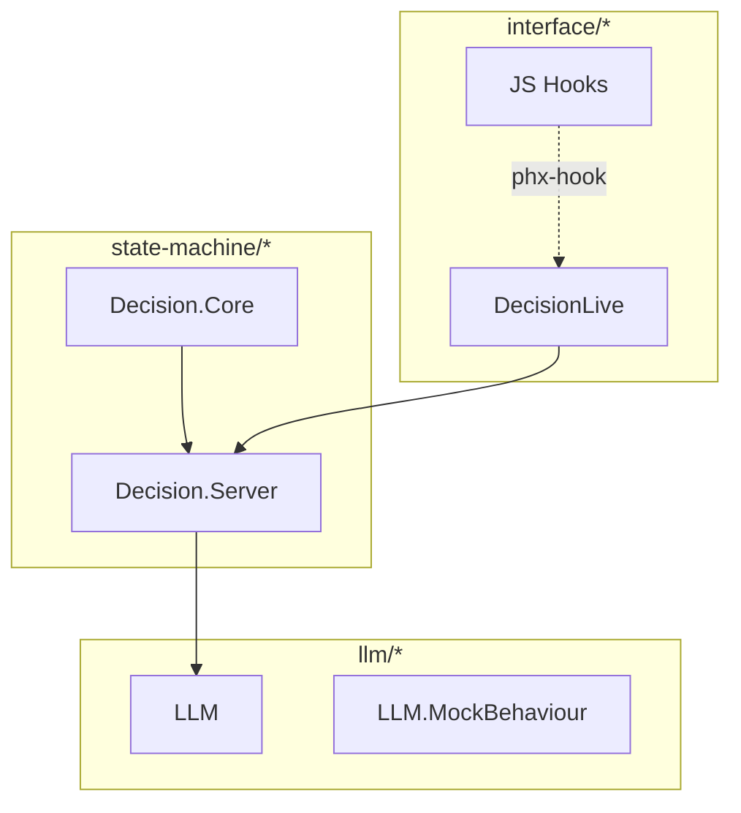

# SDF: Automated Boundary and Dependency Visualization


## Scenario

Should we adopt tooling to automatically discover and visualize code boundaries, module dependencies, and how the program uses its dependencies, so that architectural diagrams stay grounded in the actual codebase?

## Pressures

### More

1. [M1] Architectural grounding - generated diagrams reflect the real dependency graph, not a human's mental model of it
2. [M2] Dependency awareness - developers and LLMs can see how modules depend on each other and where boundaries exist
3. [M3] Drift detection - automatically detect when code structure diverges from the architecture described in SDT decisions
4. [M4] Onboarding - new contributors can understand the system's structure from generated visualizations without reading every file

### Less

1. [L1] Tooling investment - building or integrating analysis tools requires development effort and ongoing maintenance
2. [L2] Noise - dependency graphs for non-trivial systems are large and overwhelming without careful filtering and layering
3. [L3] Elixir coupling - Elixir-specific tools (mix xref, boundary) do not cover JS hooks, CSS, or infrastructure files

## Decision

Custom xref-based mix task: build a project-specific mix task that wraps `mix xref graph`, parses JS/CSS imports, and outputs SDT-aware dependency diagrams in Mermaid format

## Why(not)

In the face of **adopting tooling to automatically visualize code boundaries and dependencies**,
instead of doing nothing
(**architectural understanding comes only from reading code and SDT prose; no automated way to see the dependency graph or detect structural drift**),
we decided **to build a custom mix task that combines `mix xref graph` output for Elixir, import analysis for JS/CSS, and SDT decision metadata to generate cross-language dependency diagrams**,
to achieve **full-stack dependency visualization that covers Elixir, JavaScript, and CSS boundaries, linked to SDT decisions, without requiring a third-party boundary library**,
accepting **significant development and maintenance effort for custom tooling, and reliance on parsing heuristics for non-Elixir files**.

## Points

### For

- [M1] Combines `mix xref` (Elixir) with custom parsers for JS imports and CSS; covers the full stack, not just .ex files
- [M2] Output is Mermaid format, which integrates with the SDT diagram system (see sibling decision `sdt/diagrams`); a single visualization format across the project
- [M3] SDT-aware: the tool reads `.sdt/index.json` and overlays decision boundaries on the dependency graph, highlighting which decisions govern which clusters
- [L3] Not Elixir-coupled; custom parsers can cover `import` statements in JS hooks and `@import`/`@apply` in CSS
- [M4] Generated Mermaid diagrams can be embedded in SDT files or rendered in tree.html

### Against

- [L1] Significant development effort: a custom mix task with three parsers (Elixir xref, JS imports, CSS imports) plus Mermaid output generation
- [L1] Ongoing maintenance: parser heuristics break when file conventions change (e.g., new JS hook patterns, new CSS import syntax)
- [L2] Full-stack dependency graphs are noisy; requires careful filtering to produce useful output rather than an incomprehensible hairball
- [M1] Custom parsing of JS/CSS imports is fragile compared to using established tooling in those ecosystems (e.g., Webpack's dependency graph, PostCSS AST)
- [L1] Duplicates some functionality that the `boundary` library provides out of the box with less effort

## Consequences

- [tooling] New mix task `mix sdt.deps` or Python script; ~200-400 lines covering three language parsers and Mermaid output
- [visualization] Mermaid diagrams showing module/file dependencies with SDT decision overlays; embeddable in variant files
- [enforcement] No compile-time enforcement (unlike `boundary`); drift detection is a separate analysis step
- [dx] Full-stack visibility at the cost of maintaining custom tooling

## Evidence

`mix xref graph` produces machine-readable dependency data in multiple formats (dot, stats, plain). For JS, import analysis can be done by regex on `import ... from` and `require(...)` statements - fragile but sufficient for a controlled codebase with consistent conventions. For CSS, Tailwind + DaisyUI uses `@apply` and `@plugin` which can be grepped. The key advantage over the `boundary` library is cross-language coverage and Mermaid output. The key disadvantage is development cost - this is a custom tool that must be built and maintained. Elixir also provides `Code.ensure_loaded/1` and `Module.definitions_in/1` for runtime introspection, and `mix xref callers ModuleName` for targeted queries.

## Diagram

<!-- no diagram needed for this decision -->

## Implementation

### Mix task

```elixir
defmodule Mix.Tasks.Sdt.Deps do
  use Mix.Task

  @shortdoc "Generate SDT-aware dependency diagrams"

  def run(args) do
    # 1. Run mix xref graph --format plain and parse output
    elixir_deps = parse_xref_output()

    # 2. Parse JS hook imports
    js_deps = parse_js_imports("assets/js/hooks/")

    # 3. Read SDT index for decision boundaries
    sdt_index = read_sdt_index(".sdt/index.json")

    # 4. Overlay SDT boundaries on dependency graph
    graph = merge_graphs(elixir_deps, js_deps, sdt_index)

    # 5. Output Mermaid
    mermaid = render_mermaid(graph)
    File.write!("deps.mermaid", mermaid)
  end
end
```

### JS import parsing

```elixir
defp parse_js_imports(dir) do
  Path.wildcard(Path.join(dir, "**/*.js"))
  |> Enum.flat_map(fn file ->
    File.read!(file)
    |> String.split("\n")
    |> Enum.filter(&String.match?(&1, ~r/import .+ from/))
    |> Enum.map(fn line ->
      {file, extract_import_path(line)}
    end)
  end)
end
```

### Mermaid output with SDT overlays



### SDT-aware filtering

```bash
# Show dependencies for a specific SDT decision
mix sdt.deps --decision state-machine/core-architecture

# Show cross-boundary dependencies only
mix sdt.deps --cross-boundary

# Show full graph
mix sdt.deps --full
```

## Exceptions

<!-- no exceptions -->

## Reconsider

- observe: The custom parser breaks frequently on JS/CSS changes
  respond: Drop JS/CSS parsing; use `boundary` library for Elixir-only analysis and manual globs for non-Elixir files
- observe: The `boundary` library adds native Mermaid output support
  respond: Switch to `boundary` library; custom tooling is no longer needed
- observe: The mix task produces graphs too large to be useful
  respond: Add aggressive filtering: only show cross-boundary edges, or only show modules touched by a specific SDT decision

## Artistic

Build the lens; see everything.

## Historic

Build-your-own dependency analysis is common in teams with specific needs. Facebook's Buck build system, Google's Bazel, and Pants all include dependency graph analysis. In the Elixir ecosystem, `mix xref` provides the raw data and projects like `module_dependency_visualizer` by Devon Estes wrap it in visualization. Cross-language dependency analysis is rarer - most tools focus on a single language's module system.

## More Info

- [mix xref documentation](https://hexdocs.pm/mix/Mix.Tasks.Xref.html)
- [module_dependency_visualizer](https://github.com/devonestes/module_dependency_visualizer)
- [Mermaid flowchart syntax](https://mermaid.js.org/syntax/flowchart.html)
