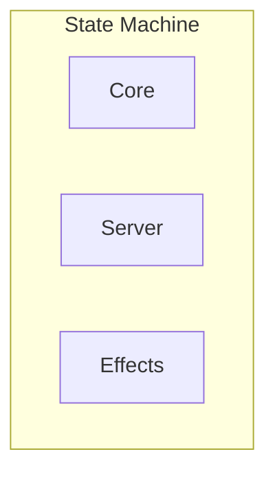
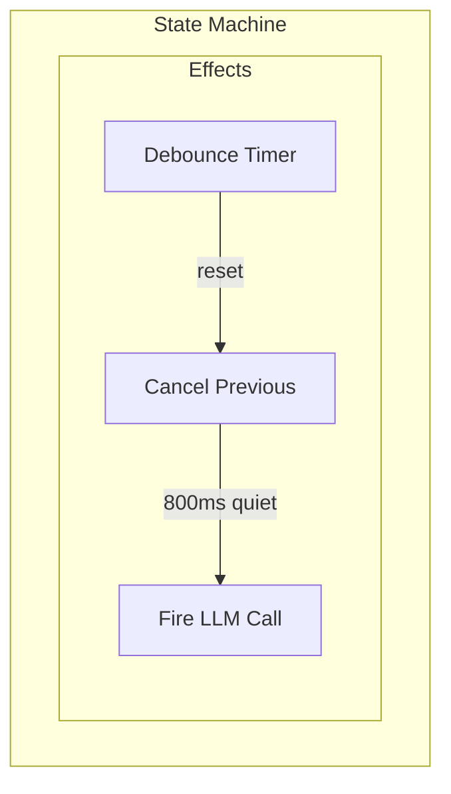

# SDF: Visual Diagrams in SDT Variant Files

## Scenario

Should SDT variant files include visual diagrams, and if so, in what format (Mermaid, ASCII, or both)? Diagrams must remain coherent across parent-child decision trees so that zooming into a child decision shows a consistent slice of the parent's diagram.

## Pressures

### More

1. [M1] LLM comprehension - diagrams in a structured format let LLMs parse and reason about architectural relationships when reading SDT files
2. [M2] Human scannability - a visual diagram communicates structure faster than prose, especially for complex multi-component decisions
3. [M3] Tree coherence - parent and child diagrams should zoom in/out consistently; a child diagram is a subgraph of the parent's diagram
4. [M4] GitHub renderability - diagrams should render natively in GitHub markdown preview without external tooling

### Less

1. [L1] Authoring friction - adding diagrams to every variant increases the cost of scaffolding and maintaining decisions
2. [L2] Staleness - diagrams that drift from the prose or implementation become misleading rather than helpful
3. [L3] Format lock-in - choosing one diagram format constrains future tooling and rendering pipelines


## Decision

Mermaid diagrams: add a `## Diagram` section to each variant file containing a Mermaid code block that visualizes the decision's architecture, with parent-child subgraph conventions for tree coherence

## Why(not)

In the face of **deciding whether SDT variant files should include visual diagrams**,
instead of doing nothing
(**prose-only Implementation sections require readers to mentally reconstruct architecture from code snippets and bullet points**),
we decided **to use Mermaid diagrams in a dedicated `## Diagram` section, with conventions for parent-child subgraph consistency**,
to achieve **machine-parseable, GitHub-renderable visual architecture that LLMs and humans can both consume and that zooms coherently across the decision tree**,
accepting **additional authoring effort per variant and a dependency on Mermaid syntax compatibility**.

## Points

### For

- [M1] Mermaid is a structured text format; LLMs can parse node IDs, edges, and subgraph boundaries to understand component relationships without guessing from prose
- [M2] Mermaid renders as SVG in GitHub, VS Code preview, and most markdown viewers; a flowchart or state diagram communicates architecture at a glance
- [M3] Convention: parent decisions define subgraph IDs; child decisions reuse the same IDs and expand only their subgraph. This creates zoom-in/zoom-out coherence across the tree
- [M4] GitHub renders ```mermaid blocks natively since 2022; no external renderer or build step needed
- [L2] Mermaid source is diffable text; PRs that change architecture show the diagram diff alongside prose changes, reducing silent drift

### Against

- [L1] Every variant needs a diagram authored and maintained; for simple decisions (e.g., testing/coverage), the diagram may be trivial and add noise
- [L3] Mermaid syntax evolves; breaking changes in mermaid-js could require diagram updates across the corpus
- [L1] LLM-scaffolded diagrams still need human review for accuracy; adds a review step to the SDT workflow

## Artistic

Draw the architecture before you code it.

## Evidence

GitHub has rendered Mermaid natively in markdown since February 2022. Mermaid supports flowcharts, sequence diagrams, state diagrams, and C4 architecture diagrams - all relevant to the kinds of decisions in this SDT corpus (state machines, data flow, component architecture). Claude and other LLMs can both generate and parse Mermaid syntax reliably, making it a good bridge format for LLM-assisted scaffolding. The existing SDT corpus has 28 decisions; roughly 8-10 of them (state-machine/*, interface/layout, realtime/pubsub, core-architecture) would benefit significantly from diagrams. Simpler decisions can use a minimal diagram or mark the section as optional.

## Consequences

- [authoring] New `## Diagram` section added to the variant file template; scaffolding skill generates a starter diagram
- [tooling] sdt.py validator checks for valid Mermaid syntax in diagram blocks; optional rendering to SVG for tree.html
- [coherence] Convention: parent defines `subgraph` IDs; children reuse and expand. sdt.py can validate ID consistency across parent-child files
- [readability] Complex decisions get a visual overview; simple decisions may use a minimal or empty diagram section

## Implementation

### Variant file addition

A new `## Diagram` section is added after `## Implementation` and before `## Reconsider`:

```markdown
## Diagram

```mermaid
flowchart TD
    subgraph core["Core (pure)"]
        handle["Core.handle/2"]
        decision["Decision struct"]
    end
    subgraph shell["Server (GenServer)"]
        dispatch["dispatch_effect/2"]
        state["GenServer state"]
    end
    handle -->|"{:ok, decision, effects}"| dispatch
    dispatch -->|broadcast| pubsub["PubSub"]
    dispatch -->|async_llm| task["Task"]
`` `
```

### Parent-child subgraph convention

Parent decisions define named subgraphs with stable IDs:



Child decisions (e.g., `state-machine/debounced-calls`) reuse the parent's subgraph ID and expand only their portion:



### Scaffolding skill integration

The SDT scaffolding skill generates a starter Mermaid diagram based on the decision's Scenario and Implementation. The diagram type is chosen automatically:
- State transitions: `stateDiagram-v2`
- Component architecture: `flowchart TD`
- Data flow: `flowchart LR`
- Sequence of interactions: `sequenceDiagram`

### Validation

sdt.py validates:
1. Every variant file has a `## Diagram` section (warning if missing, not error)
2. Mermaid code block is syntactically valid (basic parse check)
3. Subgraph IDs in child decisions match the parent's subgraph IDs

## Reconsider

- observe: Mermaid syntax changes break existing diagrams across the corpus
  respond: Pin Mermaid version in rendering tooling; batch-update diagrams when upgrading
- observe: Diagram authoring friction slows SDT scaffolding significantly
  respond: Make the Diagram section optional (warning not error) for simple decisions; let the scaffolding LLM generate first drafts
- observe: ASCII art is needed for terminal-only contexts or embedding in code comments
  respond: Consider adding an ASCII render of the Mermaid diagram as a secondary output, not a primary authoring format

## Historic

Mermaid was created by Knut Sveidqvist in 2014 as a JavaScript-based diagramming tool that uses a markdown-inspired syntax. GitHub added native Mermaid rendering in markdown in February 2022, making it the de facto standard for diagrams in markdown-based documentation. The C4 model (Simon Brown) and arc42 template both recommend embedding architecture diagrams alongside decision records.

## More Info

- [Mermaid documentation](https://mermaid.js.org/)
- [GitHub Mermaid support announcement](https://github.blog/2022-02-14-include-diagrams-markdown-files-mermaid/)
- [C4 model](https://c4model.com/)
